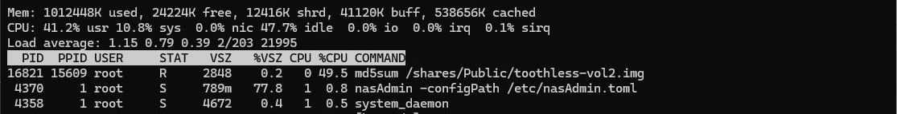
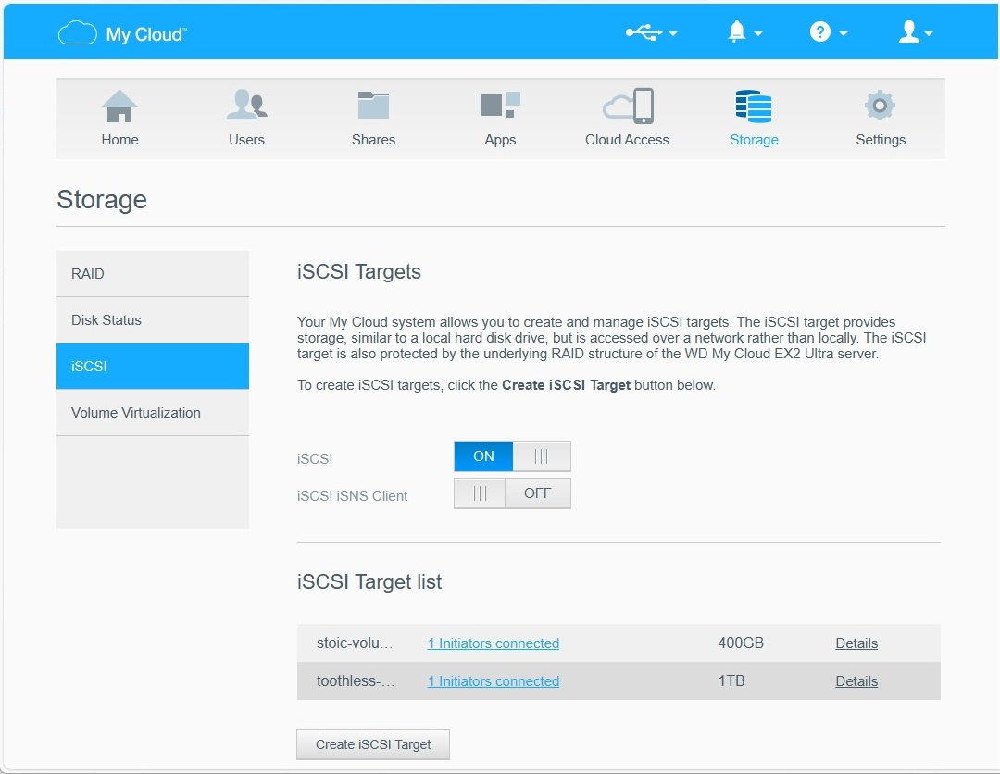
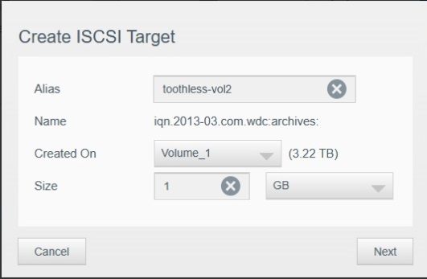
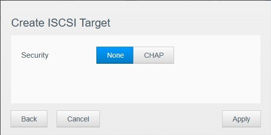
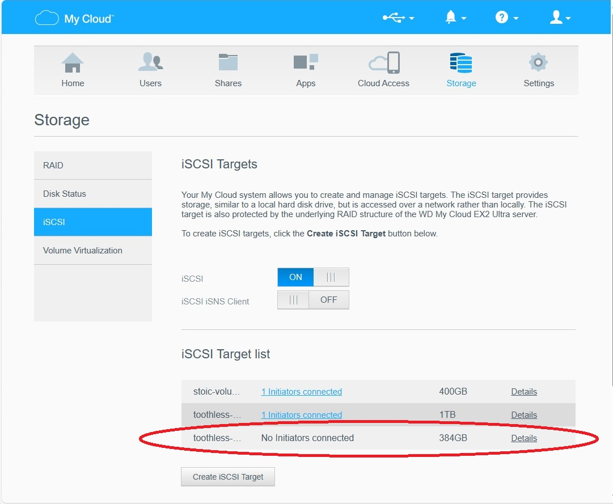

# Copy iSCSI target between two Western Digital NAS

This procedure is applicable to *[Current My Cloud devices](https://os5.mycloud.com/setup)* running *My Cloud OS 5* and has been tested on My Cloud EX2 Ultra and My Cloud EX4100 devices.

A description of iSCSI capabilities and operations of Western Digital My Cloud devices is available at *[My Cloud: Creating and Mounting an iSCSI Target](https://support-en.wd.com/app/answers/detailweb/a_id/3864/initiator/user)*.

The My Cloud devices do not expose iSCSI targets in any sharing protocol. Hence, *OS 5* has no direct capability to salvage/archive an existing iSCSI target.

---------
Even if you can login in the NAS using SSH, the secure file copy (SCP) protocol between source and destination is way too slow to copy large files and the BusyBox envirnment used in the NAS does not offer other tools.

<details>
<Summary>Primary objective: transfer the iSCSI target at "wire" speed.</Summary>  

Since the expected use case is a Gigabit interface (as found on My Cloud devices) and a very large file (e.g. hundreds of gigabytes), we can compute a realistic throughput in GB/minutes to evaluate the duration of this operation. Using standard Ethernet frames of 1538 bytes (without a VLAN tag), the maximum payload is 1500 bytes and the number of bits required to transfer 1GB of data is (1\*1000^3/1500)\*1538\*8. Presuming a sustained usage of 95% of the wire, we can transfer 95%\*1000^3\*60 bits in one minute. This yields a transfer rate of 0,144 GB/minute. This translates to roughly 19 minutes to transfer a 128GB iSCSI target.</details>

<details>
<Summary>Secondary objective: validation.</Summary>
To confirm that no corruption occured during this transfer (any harware issue on the source NAS, the network gear, and/or the destination NAS), we need a hash of the source file once the copy is terminated and a hash of the destination file before it can be exposed from the destination NAS.  

&nbsp; 

There are two issues:
- On the My Book models tested, the MD5SUM utility is rather CPU intensive as shown below:
  
and would impact troughput if done while transfering the file over the network.
- It is the user's responsability to compare these hashes. </details> 

---------
The strategy retained to minimize the overall copy operation is:
- enable SSH login on both source and destination. 
WD *OS 5* configures the user as sshd.
- copy the scripts CopyWDiSCSITarget.sh and InsertWDiSCSITarget.sh to a share in both the source and destination NAS. The examples in this ReadMe use "Public" and the scripts are accessible from "/shares/Public" in a ssh session.
- using SSH, login under the source NAS and execute the script CopyWDiSCSITarget.sh. Optional: best practices would be to restrict the script to *root* and make it executable (the script may run as is if this is ignored):
````
chown root:root /shares/Public/CopyWDiSCSITarget.sh
chmod 700 /shares/Public/CopyWDiSCSITarget.sh
````
- In the sample copy log below, one of three iSCSI target is selected and copied. As soon as the hash computation begins on the source, the hash computation can also begin on the destination. **NOTE: use a fully qualified host name to specify the destination, NetBIOS style name resolution fails in these WD NAS.**
- using SSH, log under the destination NAS and execute the script InsertWDiSCSITarget.sh ONCE the copy operation is completed. Optional: best practices would be to restrict the script to *root* and make it executable (the script may run as is if this is ignored):
````
chown root:root /shares/Public/InsertWDiSCSITarget.sh
chmod 700 /shares/Public/InsertWDiSCSITarget.sh
````
- This computation should occur in parallel with the one running on the source to minimize overall duration. The sample insertion log below shows the file moved to the directory containing the iSCSI targets in the My Book implementation.
- Before this target can be made available in the destination My Book GUI, the hashes should compare. In the samples below, each log show eb2ca07c33534a9b4529b16c7ac2a623. However, on the source, this computation took 30 minutes more than the actual copy (!) while it took the same time as the copy operation on the destination. Your mileage may vary.

---------
Finally, the destination NAS iSCSI configuration must be updated to reflect the new target. There are basically three steps:
<details>
<Summary>The target is inserted in the GUI using the built in "Create iSCSI Target" interface;</Summary>



</details>

<details>
<Summary>Create a "new 1GB" target using the file name that was copied ;</Summary>






</details>

<details>
<Summary>Verify that the iSCSI target is properly listed with the correct size.</Summary>



</details>

# The destination NAS will now accept incoming initiators for this target.
---------
Below are sample logs where a 384GB iSCSI target is copied from one WD My Book to another:

<details><summary>Sample copy log></summary>

```

PS C:\Users\ThisUser> ssh -l sshd somenas
sshd@somenas's password:
Last login: Thu Mar 21 09:42:47 2024 from 192.168.18.31


BusyBox v1.30.1 (2023-01-16 16:39:18 UTC) built-in shell (ash)
Enter 'help' for a list of built-in commands.

root@somenas ~ # /shares/Public/CopyWDiSCSITarget.sh
iSCSI targets on this volume:
  astrid-vol2
  hiccup-vol2
  toothless-vol2

Target name to copy: toothless-vol2
-rw-rw-rw-    1 root     root     384000000000 Mar 20 19:22 /mnt/HD/HD_a2/.systemfile/iscsi_images/toothless-vol2.img

Fully qualified host name of the destination server: archives.somedomain.tld
Password for root@//archives.somedomain.tld/Public:

Copy in progress ...
Thu Mar 21 11:02:25 EDT 2024
Thu Mar 21 11:58:30 EDT 2024

Hash the destination AFTER the copy ...
Thu Mar 21 11:58:30 EDT 2024
eb2ca07c33534a9b4529b16c7ac2a623  /mnt/HD/HD_a2/.systemfile/iscsi_images/toothless-vol2.img
Thu Mar 21 13:34:40 EDT 2024
root@somenas ~ #

```

</details>

<details><summary>Sample insertion log></summary>

```

PS C:\Users\Usager> ssh -l sshd archives
sshd@archives's password:
Last login: Thu Mar 21 13:27:29 2024 from 192.168.18.31


BusyBox v1.30.1 (2023-01-16 16:39:18 UTC) built-in shell (ash)
Enter 'help' for a list of built-in commands.

root@Archives ~ # /shares/Public/InsertWDiSCSITarget.sh
iSCSI targets on this volume:
  stoic-volume1
  toothless-volume1

iSCSI targets on this Public share:
  toothless-vol2

Target name to move: toothless-vol2
-rwxrwxrwx    1 nobody   share    384000000000 Mar 21 11:58 /shares/Public/toothless-vol2.img

Hash the destination BEFORE the move ...
Thu Mar 21 13:30:33 EDT 2024
eb2ca07c33534a9b4529b16c7ac2a623  /shares/Public/toothless-vol2.img
Thu Mar 21 14:25:55 EDT 2024

iSCSI targets on this volume:
  stoic-volume1
  toothless-vol2
  toothless-volume1

root@Archives ~ #

```

</details>

